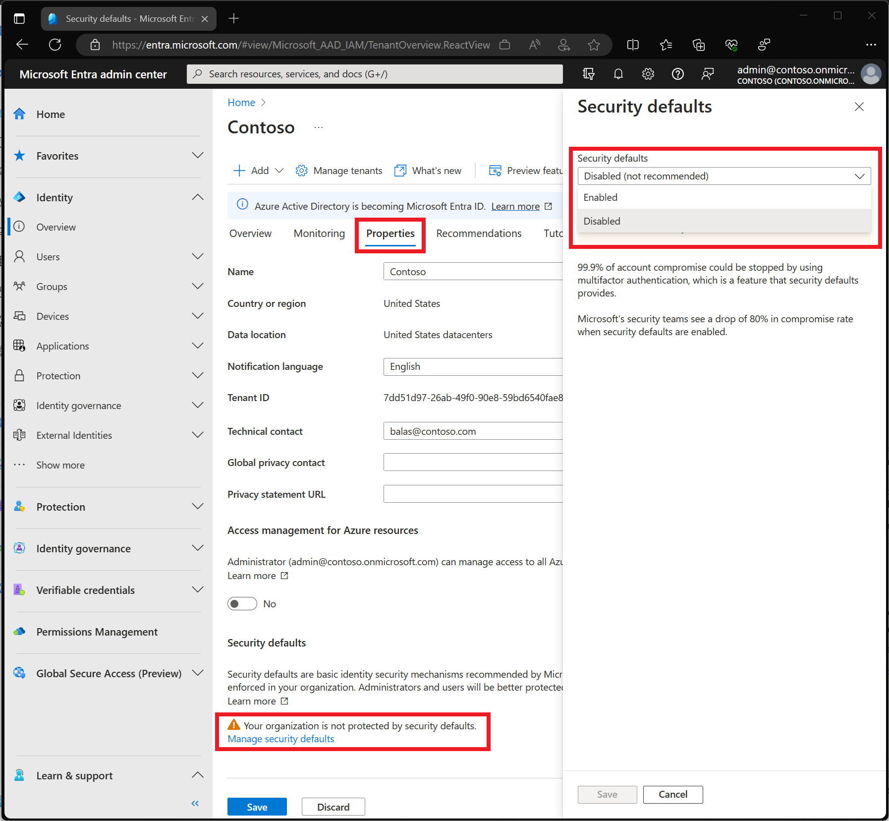

# Conectar cuentas de Outlook 365

## Troubleshooting

### Cómo crear una nueva contraseña de aplicación

Para crear una nueva contraseña de aplicación para una aplicación o dispositivo, sigue los pasos que se indican a continuación. Puedes repetir estos pasos de creación de una contraseña de aplicación para todas las aplicaciones o dispositivos que necesites.

Dirígete a la página Conceptos básicos sobre seguridad e inicia sesión en tu cuenta de Microsoft.

Selecciona Más opciones de seguridad.

En Contraseñas de aplicación, selecciona Crear una nueva contraseña de aplicación. Se genera una nueva contraseña de aplicación que aparece en la pantalla.

Escribe esta contraseña de aplicación, donde escribirías la contraseña normal de tu cuenta de Microsoft en la aplicación.

### Si no aparece la opción de contraseña de aplicación hay que habilitarla

En el Centro de administración de Microsoft > Usuarios > Usuarios activos > seleccione Configuración de servicio de autenticación > de usuario > multifactor > Permitir a los usuarios crear contraseñas de aplicación para iniciar sesión en aplicaciones que no sean de explorador.

También puede encontrarse el error:
'''
535, b'5.7.139 Authentication unsuccessful, the user credentials were incorrect.
'''

### Habilitar/Deshabilitar los valores predeterminados de seguridad

Para el error:
'''
535, b"5.7.139 Authentication unsuccessful, user is locked by your organization's security defaults policy. Contact your administrator
'''

Inicie sesión en el centro de administración de Microsoft Entra como al menos administrador de seguridad .

- Vaya a  Identidad  > Descripción general > Propiedades .
- Seleccione Administrar valores predeterminados de seguridad .
- Establezca los valores predeterminados de seguridad en Habilitado .
- Seleccione Guardar .

