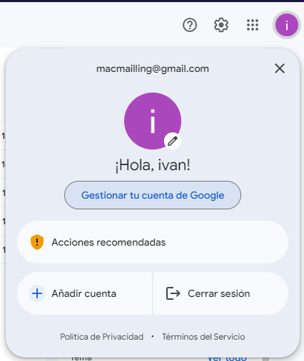
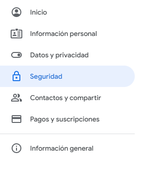
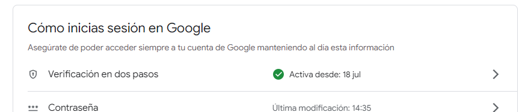
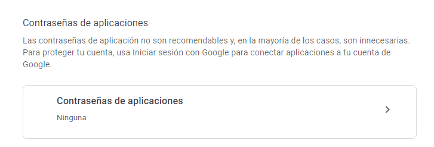
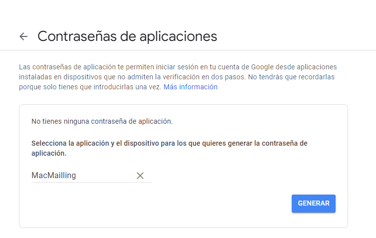
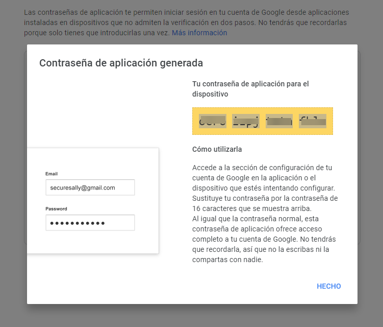
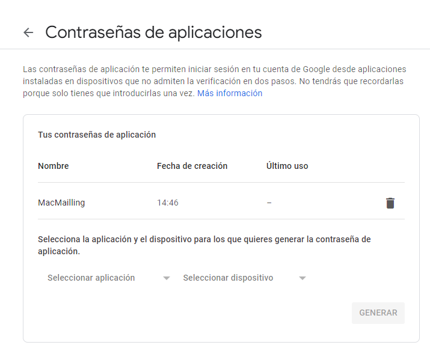

# Cómo crear y usar contraseñas de aplicaciones

    Importante: Para crear una contraseña de la aplicación, necesitas tener activada la Verificación en 2 pasos en tu Cuenta de Google.

    Si usas la Verificación en 2 pasos y recibes un error de "contraseña incorrecta" cuando accedes, intenta usar una contraseña de la aplicación.

- Ve a tu Cuenta de Google.

- Selecciona Seguridad.

- En la sección "Cómo acceder a Google", selecciona Verificación en 2 pasos.

- En la parte inferior de la página, selecciona Contraseñas de aplicaciones.

- Ingresa un nombre que te ayude a recordar dónde usarás la contraseña de la aplicación.

- Selecciona la opción Generar.

Para ingresar la contraseña de la aplicación, sigue las instrucciones que aparecen en pantalla. La contraseña de la aplicación es el código de 16 caracteres que se genera en el dispositivo.

- Selecciona Listo.

## Si configuraste la Verificación en 2 pasos, pero no encuentras la opción para agregar una contraseña de la aplicación, puede deberse a los siguientes motivos:

- Tu Cuenta de Google tiene la Verificación en 2 pasos configurada solo para las llaves de seguridad.
- Accediste a una cuenta de trabajo, de institución educativa o de otra organización.
- Tu Cuenta de Google tiene activada la Protección avanzada.

    Nota: Por lo general, deberás ingresar una contraseña de la aplicación una vez por app o dispositivo.