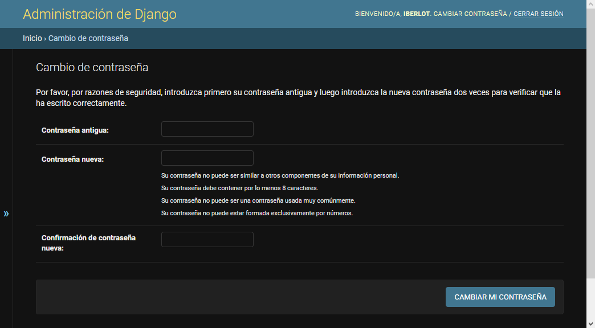
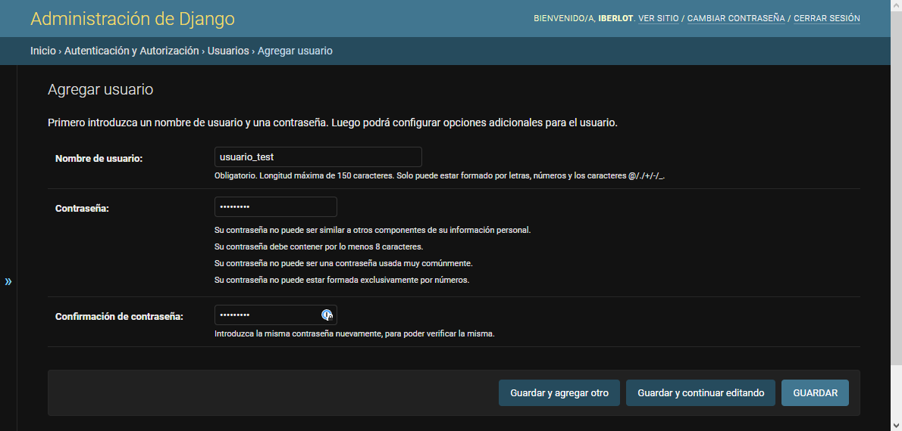
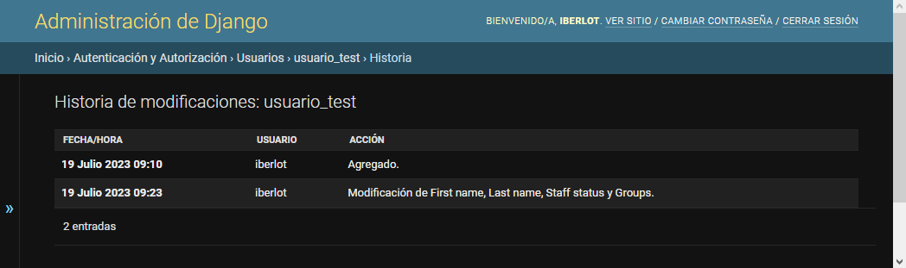
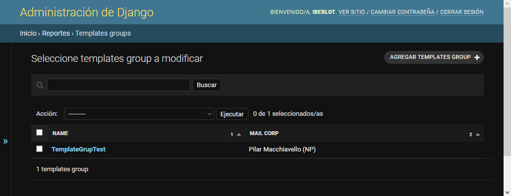

# MacMailling

Aplicación para la gestión y planificación de envíos de correos a clientes. Gestión de calendario de envíos y administración de los usuarios.

## Manual de usuario

Esta es una guía de uso de la aplicación orientada al usuario final y al administrador. Para obtener una gia técnica de implantación y mantenimiento diríjase al archivo README.md.

### Secciones

- [Pantalla de inicio](#pantalla-de-inicio)
- [Grupos](#grupos)
- [Usuarios](#usuarios)
- [Eventos](#eventos)
- [Accounts](#accounts)
- [Clientes](#clientes)
- [Clientes address](#clientes-address)
- [Clientes contacts](#clientes-contacts)
- [Clientes emails](#clientes-emails)
- [Clientes socials](#clientes-socials)
- [Clientes utms](#clientes-utms)
- [Clientes webs](#al-lado-del-bot%C3%B3n)
- [Excel files](#excel-filess)
- [Mail corps](#mail-corps)
- [Mails](#mails)
- [Mails to sends](#mails-to-sends)
- [Template files](#template-filess)
- [Templates groups](#templates-groups)
- [Calendario](#calendario)

### Secciones Auxiliares

- [Contact types](#contact-types)
- [Email types](#email-types)
- [country's](#Countrys)
- [Social types](#social-types)
- [Types](#types)
- [Web types](#web-types)

### Otros

- [Variables en mails](#Variables-en-mails)

## Pantalla de inicio

El acceso a esta es por medio de la direccion de administración del sitio [url del sitio]:8000/admin.

Ej. el acceso a el ambiente de pruebas seria por el siguiente [link](http://macmailling.eastus.cloudapp.azure.com:8000/admin/).

Al acceder lo primero que veremos seria la pantalla de inicio de sesión.

Una vez ingresadas las credenciales proporcionadas por el administrados podremos acceder a la pantalla de inicio del sitio.

En la pantalla de inicio vemos un listado con las ultimas acciones que realizo el usuario y el menu con las opciones que tiene este autorizadas.

En la esquina superior derecha de la pantalla tenderemos un botón para cerrar la sección. De esta manera podremos salir del sistema. Al presionarlo nos cerrara la sesión y nos mostrara un mensaje por si queremos volver a iniciarla.

Al lado del botón de cerrar sesión tenemos otro para cambiar la contraseña.

def get_mail_data():
    """
    This function provides a comprehensive guide for users and administrators of the MacMailling application.
    It covers different sections such as groups, users, events, clients, mails, templates, and calendar.
    The guide includes screenshots and explanations of the different screens and functionalities of the application.
    It also provides information on how to create and edit groups and users, assign permissions, and manage different types of data such as clients' addresses, contacts, emails, socials, utms, and webs.
    The guide also includes information on how to create and manage templates, mails, and events, as well as how to use the calendar feature.
    """

    # Si todo sale bien, se mostrara un mensaje de confirmación del cambio de contraseña.
    

    # Si se coloca mal la contraseña antigua se mostrara un mensaje de error y no permitirá el cambio.
    

    # [Volver al indice](#secciones)

    ## Grupos

    # Pantalla para la administración y creación de los grupos de usuarios.
    # Estos son una forma de generar grupos de permisos de acceso a la aplicación.
    # De esta forma se puede definir un conjunto de permisos y luego aplicarle los mismos a muchos usuarios distintos.
    

    ### Crear / Editar grupos

    # La pantalla de creación de grupos y de edición son la misma, la diferencia es que en la edición trae los datos del grupo que queremos modificar.
    # En esta pantalla podremos ponerle un nombre al grupo y seleccionar los permisos que tendrá cada persona.
    

    # Los permisos se asignan pasándolos de la pantalla de permisos disponibles a permisos seleccionados.
    # Estos permisos se dividen en cuatro tipos:
    # - **Add**: *agregar un elemento.* Si no se da permisos de Add el usuario no vera el botón de nuevo en esa pantalla y no podrá agregar nuevos elementos.
    # - **Change**: *cambiar un elemento.* Si no se dan los permisos de change el usuario no podrá modificar los datos ya existentes.
    # - **Delete**: *eliminar un elemento.* Si no se dan permisos de delete no se podrán eliminar los elementos de los listados.
    # - **View**: *ver elementos.* Si no se dan permisos de view el usuario no vera ese elemento en el menu, ni podrá acceder al listado de estos.
    

    # Luego de crear un grupo veremos un mensaje de confirmación y este aparecerá en el listado y en la lista de grupos para agregarles a los usuarios.
    

    ### Eliminar grupos

    # Para eliminar un grupo se selecciona este tildándolo y en el menu de acciones seleccionar la opción *"Eliminar grupos seleccionados/as"* , luego presionar el botón Ejecutar.
    

    # Si esta todo correcto se pedirá la confirmación de la eliminación.
    

    # Luego de aceptar volveremos al listado y veremos la confirmación del borrad

    # Si un grupo llega a estar asociado a algún usuario ese usuario dejara de tenerlo en su listado de grupos asociados.

    # [Volver al indice](#secciones)

    ## Usuarios

    # En esta pantalla podemos crear y administrar los usuarios que tendrán acceso a la aplicación
    

    ### Crear / Editar usuarios

    # En este caso la pantalla de creación de usuarios y de la de edición no son la misma, ya que a diferencia de la de edición para crear un usuario primero deberemos poner el nombre de usuario a utilizar y la contraseña.
    
Al guardar nos llevara a una pantalla donde podemos editar los datos del usuario, esta si igual a la pantalla de edición de los datos del formulario.

Los datos que se pueden agregar en esta pantalla son:

- Información general
  - Nombre
  - Apellido
  - Direccion de mail
- Permisos
  - Activo: *Tildado por defecto*. Si se deshabilita este campo el usuario dejara de tener acceso a la aplicación.
  - Es staff: Imprescindible para acceder a los menu de edición de la aplicación.
  - Es superusuario: Al tildar esta casilla se le habilitan al usuario permisos de administrador. Con estos puede acceder a cualquier area del sistema.
  - Grupos: grupos de permisos que tiene asociado el usuario.
  - Permisos de usuario: En caso de requerir un permiso particular que no es abarcado por los grupos se puede otorgar en esta sección particularmente. Por ejemplo un usuario que solo puede subir los archivos excel a la aplicación tendrá permiso de vista y de agregar en excel files.
- Fechas importantes *(ambas fechas se cargan automáticamente y se desaconseja su modificación)*
  - Ultimo ingreso
  - Fecha de creación

Entre las acciones disponibles en la pantalla de edición del usuario tenemos el historial. Al acceder podemos ver todas las modificaciones que sufrió ese registro.

Al confirmar los cambios guardamos y nos llevara nuevamente a la pantalla del listado mostrándonos un mensaje de confirmación.

### Eliminar usuarios

Para eliminar un usuario se selecciona este tildándolo y en el menu de acciones seleccionar la opción *"Eliminar usuarios seleccionados/as"* , luego presionar el botón Ejecutar.

Si esta todo correcto se pedirá la confirmación de la eliminación.

Luego de aceptar volveremos al listado y veremos la confirmación del borrado.

Si el usuario llega a estar asociado a algún registro nos mostrara un mensaje de error.

- [Volver al indice](#secciones)

## Eventos

En esta pantalla podemos crear y administrar los eventos del calendario.

### Crear / Editar eventos

La pantalla de creación de eventos y de edición son la misma, la diferencia es que en la edición trae los datos del evento que queremos modificar.

En esta pantalla podremos:

- definir un evento como activo
- Marcarlo como eliminado.
- Seleccionar el usuario al que pertenece
- Ponerle un titulo al evento
- Poner una descripción en el evento
- Seleccionar la fecha y hora de inicio
- Seleccionar la fecha y hora de finalización

### Eliminar eventos

Para eliminar un evento se selecciona este tildándolo y en el menu de acciones seleccionar la opción *"Eliminar events seleccionados/as"* , luego presionar el botón Ejecutar.

Si esta todo correcto se pedirá la confirmación de la eliminación.

Luego de aceptar volveremos al listado y veremos la confirmación del borrado.

Recuerde que al eliminar un evento este dejara de mostrarse en el calendario y en los historiales.

- [Volver al indice](#secciones)

## Accounts

En esta pantalla podemos crear y administrar los datos de las cuentas. Una cuenta puede tener un [supervisor](#usuarios) y multiples [cuentas de mail](#mail-corps) asociadas. Estas cuentas a su vez tendrán una [persona](#usuarios) que las supervisara.

### Crear / Editar Account

La pantalla de creación de cuentas y de edición son la misma, la diferencia es que en la edición trae los datos del account que queremos modificar.

En esta pantalla podremos:

- Ponerle un nombre a la cuenta
- seleccionar el usuario supervisor

### Eliminar Account

Para eliminar un account se selecciona este tildándolo y en el menu de acciones seleccionar la opción *"Eliminar account seleccionados/as"* , luego presionar el botón Ejecutar.

Si esta todo correcto se pedirá la confirmación de la eliminación.

Luego de aceptar volveremos al listado y veremos la confirmación del borrado.

Si llega a haber un [cliente](#clientes) o una [cuenta de mail](#mail-corps) asociados al account se nos mostrara un mensaje de error.

- [Volver al indice](#secciones)

## Clientes

En esta pantalla podemos crear y administrar los datos de los clientes

### Crear / Editar Clientes

La pantalla de creación de clientes y de edición son la misma, la diferencia es que en la edición trae los datos del cliente que queremos modificar.

En esta pantalla podremos agregar/modificar los distintos datos del cliente. Es importante que datos como el [Account](#accounts), el [Country](#clientes), el [Type](#clientes), el [Currency](#clientes) y el [Responsible](#clientes) deben estar cargados de antemano en sus correspondientes tablas.

### Eliminar Clientes

Para eliminar un XXX se selecciona este tildándolo y en el menu de acciones seleccionar la opción *"Eliminar XXX seleccionados/as"* , luego presionar el botón Ejecutar.

Si esta todo correcto se pedirá la confirmación de la eliminación.

Luego de aceptar volveremos al listado y veremos la confirmación del borrado.

Si llega a haber un XXX el XXX asociado nos mostrara un mensaje de error.

- [Volver al indice](#secciones)

## Clientes address

En esta pantalla podemos crear y administrar los XXX

### Crear / Editar XXX

La pantalla de creación de XXX y de edición son la misma, la diferencia es que en la edición trae los datos del XXX que queremos modificar.

En esta pantalla podremos:

### Eliminar XXX

Para eliminar un XXX se selecciona este tildándolo y en el menu de acciones seleccionar la opción *"Eliminar XXX seleccionados/as"* , luego presionar el botón Ejecutar.

Si esta todo correcto se pedirá la confirmación de la eliminación.

Luego de aceptar volveremos al listado y veremos la confirmación del borrado.

Si llega a haber un XXX el XXX asociado nos mostrara un mensaje de error.

- [Volver al indice](#secciones)

## Clientes contacts

En esta pantalla podemos crear y administrar los XXX

### Crear / Editar XXX

La pantalla de creación de XXX y de edición son la misma, la diferencia es que en la edición trae los datos del XXX que queremos modificar.

En esta pantalla podremos:

### Eliminar XXX

Para eliminar un XXX se selecciona este tildándolo y en el menu de acciones seleccionar la opción *"Eliminar XXX seleccionados/as"* , luego presionar el botón Ejecutar.

Si esta todo correcto se pedirá la confirmación de la eliminación.

Luego de aceptar volveremos al listado y veremos la confirmación del borrado.

Si llega a haber un XXX el XXX asociado nos mostrara un mensaje de error.

- [Volver al indice](#secciones)

## Clientes emails

En esta pantalla podemos crear y administrar los XXX

### Crear / Editar XXX

La pantalla de creación de XXX y de edición son la misma, la diferencia es que en la edición trae los datos del XXX que queremos modificar.

En esta pantalla podremos:

### Eliminar XXX

Para eliminar un XXX se selecciona este tildándolo y en el menu de acciones seleccionar la opción *"Eliminar XXX seleccionados/as"* , luego presionar el botón Ejecutar.

Si esta todo correcto se pedirá la confirmación de la eliminación.

Luego de aceptar volveremos al listado y veremos la confirmación del borrado.

Si llega a haber un XXX el XXX asociado nos mostrara un mensaje de error.

- [Volver al indice](#secciones)

## Clientes socials

En esta pantalla podemos crear y administrar los XXX

### Crear / Editar XXX

La pantalla de creación de XXX y de edición son la misma, la diferencia es que en la edición trae los datos del XXX que queremos modificar.

En esta pantalla podremos:

### Eliminar XXX

Para eliminar un XXX se selecciona este tildándolo y en el menu de acciones seleccionar la opción *"Eliminar XXX seleccionados/as"* , luego presionar el botón Ejecutar.

Si esta todo correcto se pedirá la confirmación de la eliminación.

Luego de aceptar volveremos al listado y veremos la confirmación del borrado.

Si llega a haber un XXX el XXX asociado nos mostrara un mensaje de error.

- [Volver al indice](#secciones)

## Clientes utms

En esta pantalla podemos crear y administrar los XXX

### Crear / Editar XXX

La pantalla de creación de XXX y de edición son la misma, la diferencia es que en la edición trae los datos del XXX que queremos modificar.

En esta pantalla podremos:

### Eliminar XXX

Para eliminar un XXX se selecciona este tildándolo y en el menu de acciones seleccionar la opción *"Eliminar XXX seleccionados/as"* , luego presionar el botón Ejecutar.

Si esta todo correcto se pedirá la confirmación de la eliminación.

Luego de aceptar volveremos al listado y veremos la confirmación del borrado.

Si llega a haber un XXX el XXX asociado nos mostrara un mensaje de error.

- [Volver al indice](#secciones)

## Clientes webs

En esta pantalla podemos crear y administrar los XXX

### Crear / Editar XXX

La pantalla de creación de XXX y de edición son la misma, la diferencia es que en la edición trae los datos del XXX que queremos modificar.

En esta pantalla podremos:

### Eliminar XXX

Para eliminar un XXX se selecciona este tildándolo y en el menu de acciones seleccionar la opción *"Eliminar XXX seleccionados/as"* , luego presionar el botón Ejecutar.

Si esta todo correcto se pedirá la confirmación de la eliminación.

Luego de aceptar volveremos al listado y veremos la confirmación del borrado.

Si llega a haber un XXX el XXX asociado nos mostrara un mensaje de error.

- [Volver al indice](#secciones)

## Contact types

En esta pantalla podemos crear y administrar los XXX

### Crear / Editar XXX

La pantalla de creación de XXX y de edición son la misma, la diferencia es que en la edición trae los datos del XXX que queremos modificar.

En esta pantalla podremos:

### Eliminar XXX

Para eliminar un XXX se selecciona este tildándolo y en el menu de acciones seleccionar la opción *"Eliminar XXX seleccionados/as"* , luego presionar el botón Ejecutar.

Si esta todo correcto se pedirá la confirmación de la eliminación.

Luego de aceptar volveremos al listado y veremos la confirmación del borrado.

Si llega a haber un XXX el XXX asociado nos mostrara un mensaje de error.

- [Volver al indice](#secciones)

## Countrys

En esta pantalla podemos crear y administrar los XXX

### Crear / Editar XXX

La pantalla de creación de XXX y de edición son la misma, la diferencia es que en la edición trae los datos del XXX que queremos modificar.

En esta pantalla podremos:

### Eliminar XXX

Para eliminar un XXX se selecciona este tildándolo y en el menu de acciones seleccionar la opción *"Eliminar XXX seleccionados/as"* , luego presionar el botón Ejecutar.

Si esta todo correcto se pedirá la confirmación de la eliminación.

Luego de aceptar volveremos al listado y veremos la confirmación del borrado.

Si llega a haber un XXX el XXX asociado nos mostrara un mensaje de error.

- [Volver al indice](#secciones)

## Email types

En esta pantalla podemos crear y administrar los XXX

### Crear / Editar XXX

La pantalla de creación de XXX y de edición son la misma, la diferencia es que en la edición trae los datos del XXX que queremos modificar.

En esta pantalla podremos:

### Eliminar XXX

Para eliminar un XXX se selecciona este tildándolo y en el menu de acciones seleccionar la opción *"Eliminar XXX seleccionados/as"* , luego presionar el botón Ejecutar.

Si esta todo correcto se pedirá la confirmación de la eliminación.

Luego de aceptar volveremos al listado y veremos la confirmación del borrado.

Si llega a haber un XXX el XXX asociado nos mostrara un mensaje de error.

- [Volver al indice](#secciones)

## Excel filess

En esta pantalla podemos crear y administrar los XXX

### Crear / Editar XXX

La pantalla de creación de XXX y de edición son la misma, la diferencia es que en la edición trae los datos del XXX que queremos modificar.

En esta pantalla podremos:

### Eliminar XXX

Para eliminar un XXX se selecciona este tildándolo y en el menu de acciones seleccionar la opción *"Eliminar XXX seleccionados/as"* , luego presionar el botón Ejecutar.

Si esta todo correcto se pedirá la confirmación de la eliminación.

Luego de aceptar volveremos al listado y veremos la confirmación del borrado.

Si llega a haber un XXX el XXX asociado nos mostrara un mensaje de error.

- [Volver al indice](#secciones)

## Mail corps

En esta pantalla podemos crear y administrar los XXX

### Crear / Editar XXX

La pantalla de creación de XXX y de edición son la misma, la diferencia es que en la edición trae los datos del XXX que queremos modificar.

En esta pantalla podremos:

### Eliminar XXX

Para eliminar un XXX se selecciona este tildándolo y en el menu de acciones seleccionar la opción *"Eliminar XXX seleccionados/as"* , luego presionar el botón Ejecutar.

Si esta todo correcto se pedirá la confirmación de la eliminación.

Luego de aceptar volveremos al listado y veremos la confirmación del borrado.

Si llega a haber un XXX el XXX asociado nos mostrara un mensaje de error.

- [Volver al indice](#secciones)

## Mails

En esta pantalla podemos crear y administrar los mails que luego se enviaran a los clientes.

Al ingresar en esta sección tenemos un listado de los mails ya creados. Estos tienen un reborde de color diferente dependiendo del tiempo faltante para el envío del proximo mail.

En esta pantalla podemos ordenar los mails por los items del titulo, simplemente haciendo click sobre el nombre en el titulo. (Por Ejemplo: si queremos ordenar los mails por el estado, hacemos click sobre el titulo que dice STATUS).

Podemos ademas filtrar los elementos de la lista por la casilla desde la que se van a enviar, por el numero de envío o por el estado. Esto lo logramos presionando en las opciones dentro del cuadro de filtrar.

Dentro de las acciones generales que podemos tomar en esta pantalla se encuentran: Editar los datos del mail, accediendo a su información haciendo click sobre el nombre del mail corporativo asociado (dato azul del listado).

Crear uno nuevo presionando en el botón agregar.

O eliminar el mail, tildándolo, seleccionando la acción "Eliminar mails seleccionados/as" y presionando en ejecutar.

    Al enviar el mail automáticamente se cambia el numero del ultimo mail enviado y se traen los datos del proximo mail a enviar.
    Si no llega a haber algún template fail que corresponda con el numero del mail a enviar se le cambia el estado a al mail.

### Crear / Editar Mails

La pantalla de creación de Mail y de edición son la misma, la diferencia es que en la edición trae los datos del mail que queremos modificar.

En esta pantalla podremos:

- Seleccionar la casilla desde la que se va a enviar el mail.
- Seleccionar el cliente.
- Poner un Subject al mail.
- Escribir un cuerpo personalizado para el mail. Este cuerpo puede contener texto enriquecido e imágenes.
- Agregar archivos adjuntos al mail.
- Tildar el mail como activo.
- Tildar el mail como respondido.
- Tildar el mail como que tiene un template asociado para utilizar.
- Se puede seleccionar el grupo de templates que tiene asociado.
- Modificar el numero de mail enviado
- Modificar cuando se envío el ultimo mail.
- Cambiar la frecuencia a la que debe enviarse los mails.

### Eliminar Mails

Para eliminar un mail se selecciona este tildándolo y en el menu de acciones seleccionar la opción *"Eliminar mails seleccionados/as"* , luego presionar el botón Ejecutar.

Si esta todo correcto se pedirá la confirmación de la eliminación.

Luego de aceptar volveremos al listado y veremos la confirmación del borrado.

Si llega a haber un mail en la cola de envío asociado nos mostrara un mensaje de error.

### Preparar Envío

Para preparar el envío de los mails vamos a seleccionarlos y en el selector de acciones vamos a poner la opción *"Preparar envío"*.

Una vez preparado el envio se creara un registro en Mails to send.

- [Volver al indice](#secciones)

## Mails to sends

En esta pantalla podemos editar y administrar la cola de envío de mails.

Ademas, en caso de requerirlo, podemos seleccionar un mail y forzar su envio.

De forma automática, si llega a haber algún error en el envio del mail se cambiara el status del mismo, con lo que ya no se intentara el envio y se agregara un mensaje de error en el campo de texto correspondiente para su revision por parte de un usuario.

> Nota: Al enviar el mail se le asigna un nuevo send number al sumarle uno al anterior. Si este numero es menor que el numero máximo del template group se localiza el template file asociado a ese numero y se recupera la información para asociarla al mail. Si el numero es mayor se le resta el max number la cantidad de veces que sea necesarias hasta que quede un numero menor y ese es el template file que se va a utilizar.
>Ejemplo:
>Si tenemos un template group que el valor máximo es 7 y un mail que va por el send number 11. Este mail va a tomar los datos del template file 4.
>Esto viene de 11 - 7 = 4

### Editar Mails to send

La pantalla de creación de Mails to send y de edición son la misma, la diferencia es que en la edición trae los datos del Mail que queremos modificar.

En esta pantalla podremos:

- Cambiar el mail que se enviara en caso de ser necesario.
- Cambiar el estado del mail.
- Aprobarlo para su envio.

Un mail solo se enviara si esta aprobado.

### Eliminar Mails to send

Para eliminar un Mails to send se selecciona este tildándolo y en el menu de acciones seleccionar la opción *"Eliminar Mails to send seleccionados/as"* , luego presionar el botón Ejecutar.

Si esta todo correcto se pedirá la confirmación de la eliminación.

Luego de aceptar volveremos al listado y veremos la confirmación del borrado.

- [Volver al indice](#secciones)

## Social types

En esta pantalla podemos crear y administrar los XXX

### Crear / Editar XXX

La pantalla de creación de XXX y de edición son la misma, la diferencia es que en la edición trae los datos del XXX que queremos modificar.

En esta pantalla podremos:

### Eliminar XXX

Para eliminar un XXX se selecciona este tildándolo y en el menu de acciones seleccionar la opción *"Eliminar XXX seleccionados/as"* , luego presionar el botón Ejecutar.

Si esta todo correcto se pedirá la confirmación de la eliminación.

Luego de aceptar volveremos al listado y veremos la confirmación del borrado.

Si llega a haber un XXX el XXX asociado nos mostrara un mensaje de error.

- [Volver al indice](#secciones)

## Template files

En esta pantalla podemos crear y administrar los XXX

### Crear / Editar un template file

La pantalla de creación de XXX y de edición son la misma, la diferencia es que en la edición trae los datos del XXX que queremos modificar.

En esta pantalla podremos:

Al presionar guardar al momento de editar el template file automáticamente propagaremos ese cambio a todos los mails a los que corresponda.

Otra de las acciones que tenemos disponibles es la extracción de la información de un archivo para su utilización. Al crear un template file podemos asociarle un archivo de texto. Si vamos a la opción *"Propagación de plantilla"* el sistema recuperara los datos de este archivo y remplazará lo que haya en el cuadro de texto por la información de este.

> Nota: Recuerde que tanto si propaga los cambios del archivo (remplazando lo del cuadro de texto del registro) como si guarda la información en el registro (pisando el cuerpo del mail) son cambios que no tienen vuelta atrás.

### Eliminar XXX

Para eliminar un XXX se selecciona este tildándolo y en el menu de acciones seleccionar la opción *"Eliminar XXX seleccionados/as"* , luego presionar el botón Ejecutar.

Si esta todo correcto se pedirá la confirmación de la eliminación.

Luego de aceptar volveremos al listado y veremos la confirmación del borrado.

Si llega a haber un XXX el XXX asociado nos mostrara un mensaje de error.

- [Volver al indice](#secciones)

## Templates groups

En esta pantalla podemos crear y administrar los XXX

### Crear / Editar XXX

La pantalla de creación de XXX y de edición son la misma, la diferencia es que en la edición trae los datos del XXX que queremos modificar.

En esta pantalla podremos:

### Eliminar XXX

Para eliminar un XXX se selecciona este tildándolo y en el menu de acciones seleccionar la opción *"Eliminar XXX seleccionados/as"* , luego presionar el botón Ejecutar.

Si esta todo correcto se pedirá la confirmación de la eliminación.

Luego de aceptar volveremos al listado y veremos la confirmación del borrado.

Si llega a haber un XXX el XXX asociado nos mostrara un mensaje de error.

- [Volver al indice](#secciones)

## Web types

En esta pantalla podemos crear y administrar los XXX

### Crear / Editar Web types

La pantalla de creación de Web types y de edición son la misma, la diferencia es que en la edición trae los datos del Web types que queremos modificar.

En esta pantalla podremos:

### Eliminar Web types

Para eliminar un Web types se selecciona este tildándolo y en el menu de acciones seleccionar la opción *"Eliminar Web types seleccionados/as"* , luego presionar el botón Ejecutar.

Si esta todo correcto se pedirá la confirmación de la eliminación.

Luego de aceptar volveremos al listado y veremos la confirmación del borrado.

Si llega a haber un Web types asociado a algún registro nos mostrara un mensaje de error.

- [Volver al indice](#secciones)

### Calendario

## Otros

### Variables en mails

Las siguientes son el listado de palabras reservadas que se pueden utilizar para recuperar los datos de la base y usarlos en los cuerpos de los mensajes.

- {{Subject}} : Asunto del mail.
- {{From}} : Mail desde el que se envía.
- {{To}} : Mail al que se envía.
- {{Date}} : Fecha del envío.
- {{number}} : Numero de mail.
- {{salutation}} : Saludo.
- {{first_name}} : Primer nombre.
- {{middle_name}} : Nombre medio.
- {{last_name}} : Apellido.
- {{lead_name}} : lead name.
- {{data}} : Cliente.
- {{company_name}} : Nombre de la compañía.
- {{position}} : Cargo.
- {{type}} : Corresponde a cliente tipo.
- {{firma}} : Firma del mail.

## Notas importantes

Es muy importante crear las [cuentas](#accounts) y los [mails corporativos](#mail-corps) asociados antes de procesar el Excel. De otra forma es muy probable que se retorne un mensaje de error.

esar el Excel. De otra forma es muy probable que se retorne un mensaje de error.

